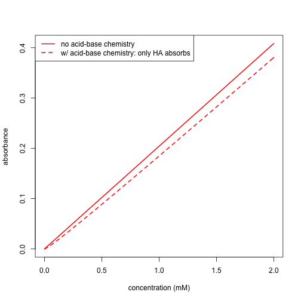

# Introduction
This learning module provided an introduction to Beer's law that is suitable for either an introductory course or an advanced course in analtyical chemistry. The module consists of seven investigations:

* Investigation 0: Recalling Beer's Law
* Investigation 1: Absorbance Spectra
* Investigation 2: Calibration Curves
* Investigation 3: Fundamental Limitation to Beer's Law
* Investigation 4: Instrumental Limitation to Beer's Law: Polychromatic Radiation
* Investigation 5: Instrumental Limitation to Beer's Law: Stray Light
* Investigation 6: Chemical Limitation to Beer's Law

The learning module is programmed in R (www.r-project.org) using the Shiny package, which allows for interactive features. Each investigation includes a brief introduction, an explanation of the controls available to the user---sliders, radio buttons, and buttons---and the type of plots, tables, and statistical summaries produced by the underlying code. Each investigation also includes some suggestions of things to explore and/or questions to answer.

The purpose of this document is to provide instructors with additional background on the program's features and data sets, to provide representative examples or the results students might generate, and to provide suggestions of possible ways to make use of the module's investigations.

Note: The dimensions for some of the figures in this document are not the same as their respective dimensions within the application; as a result, the legends included with the figures in this document partially overlap the data, although not in a way that obscures meaning.

# Some Background Details on the Data Used in the Learning Module
The data included with this learning module consists of two objects: a data frame with 351 rows and 20 columns, and a numerical vector with 14 values. As shown here, each row of the data frame provides information for one wavelength in the range 400 nm to 750 nm, and each of the 20 columns provides values for a different variable:

* Column 1: wavelengths
* Column 2: absorbance values for a 5.000 mM standard solution of the analyte (noise free)
* Column 3: transmittance values for a 5.000 mM standard solution of the analyte (noise free)
* Column 4: power spectrum for the reference (noise free)
* Column 5: power spectrum for the sample (noise free)
* Column 6: $\epsilon$b values for the analyte (noise free)
* Column 7: absorbance values for a blank (with 0.2%T noise added)
* Columns 8-20: absorbance values for a series of standards with concentrations of 0.100 mM, 0.200 mM, 0.400 mM, 0.500 mM, 0.600 mM, 0.800 mM, 1.000 mM, 2.000 mM, 4.000 mM, 5.000 mM, 6.000 mM, 8.000 mM, and 10.000 mM (with 0.2%T noise added)

The numerical vector contains the concentrations of analyte in each of the standards, as noted above.

A brief description of how this data was created is in order. The power spectrum for the reference is taken from the emission profile of a tungsten-halogen visible source; the original data is from Thor labs for model SLS201 (www.thorlabs.com) and gives power as a function of wavelength from 400 nm to 2600 nm in 10 nm intervals. This data was trimmed to the range 400 nm to 750 nm and additional values added at 1 nm intervals using a linear interpolation over each 10 nm interval. The resulting power spectrum was assigned as the reference and is stored in the data frame's fourth column.

The absorbance values for the standard solution of 5.000 mM analyte was simulated in R using a function written for that purpose; the resulting spectrum is the sum of three Gaussian curves centered at 450 nm, 550 nm, and 650 nm, with respective standard deviations of 30 nm, 30 nm, and 20 nm, and respective peak heights of 25, 10, and 50. The resulting absorbance spectrum is shown here in blue (with values stored in the data frame's second column); the dashed red lines show the three Gaussian functions that make up the spectrum.


This absorbance spectrum was used to generate the $\epsilon b$ values in the data frame's sixth column by dividing by the standard's molar concentration of 0.00500 M, and the transmittance values in the data frame's third column were calculated as $T={ 10 }^{ -A }$. The sample's power spectrum was calculated as ${ P }_{ samp }=T\times { P }_{ ref }$ and stored in the data frame's fifth column.

Finally, the absorbance spectrum for the blank and for each standard was created using the followign equation 

$$A=\varepsilon bC\times \left( corr \right)$$

where the standard values for $\epsilon b$ are in the data frame's sixth column and the concentrations of the standards are in their vector, and where the correction factor ($corr$), whose values are shown here

```
corr = c(1.000, 0.9987, 0.9974, 0.9948, 0.9934, 0.9922, 0.9896, 
         0.9870, 0.9624, 0.9271, 0.9040, 0.8835, 0.8316, 0.7733)
```

is designed to make obvious a deviation from Beer's law when the analyte's concentration is greater than 2.000 mM.

Noise was added to each absorbance value by first converting it to a transmittance, then adding a value drawn from a random normal distribution centered on zero with a standard deviation of 0.002 (0.2%T), and, finally, converting the transmittance back into an absorbance value. The resulting spectra for the blank and for all 13 standards are shown here


# Investigation 0
This introductory investigation asks students to remember that Beer's law relates a sample's absorbance to the concentration of the absorbing species, the distance light travels through the sample, and the absorbing species' molar absorptivity. The intent here simply is for students to recall that $A=\epsilon bC$ and to review how these four values relate to each other. 

For the first set of cuvettes, tudents should recognize that the absorbance values are identical when viewed from the side because $\epsilon$, b, and C are constant, but that when viewed from the top, the absorbance values increase proportionally with the increase in the solution's height. For the second set of cuvettes, students should recognize that the product of b and C is the same for all four cuvettes when viewed from the top, a result that is consistent with a constant value for $\epsilon$.

# Investigation 1
This investigation presents students with the power spectra for the reference and for the standard solution that is 5.000 mM in analyte, the data for which are available as a .csv file using the "Download" button. To create the transmittance spectrum and the absorbance spectrum, students should use the equations $T=\frac { { P }_{ sam } }{ { P }_{ ref } }$ and $A=-logT$, which yields the results shown here


Students can check their work by using the radio buttons to display the transmittance or the absorbance spectrum and to view the first six values for each.

# Investigation 2
In this investigation, students are presented with the absorbance spectra for the blank and for a set of standards with concentrations of 0.200 mM, 0.400 mM, 0.600 mM, 0.800 mM, and 1.000 mM. The slider, which increments in steps of 1 nm, allows students to select the optimum analytical wavelength for quantitative work---this is a wavelength of 649 nm, but students may reasonably select values close to this---and to retrieve the absorbance data for the standards at this wavelength. After plotting the calibration data and completing a regression analysis, students can evaluate their results by checking the box for "Show Model?" and examining the resulting regression model. The calibration curve and the regression model when using a wavelength of 649 nm are shown here


```
## 
## Call:
## lm(formula = abs ~ conc)
## 
## Residuals:
##          1          2          3          4          5          6 
## -0.0002444 -0.0003329  0.0004464  0.0004529  0.0003084 -0.0006305 
## 
## Coefficients:
##              Estimate Std. Error t value Pr(>|t|)    
## (Intercept) 0.0010898  0.0003739   2.915   0.0435 *  
## conc        0.1988782  0.0006175 322.068 5.58e-10 ***
## ---
## Signif. codes:  0 '***' 0.001 '**' 0.01 '*' 0.05 '.' 0.1 ' ' 1
## 
## Residual standard error: 0.0005166 on 4 degrees of freedom
## Multiple R-squared:      1,	Adjusted R-squared:      1 
## F-statistic: 1.037e+05 on 1 and 4 DF,  p-value: 5.576e-10
```

# Investigation 3
This investigation introduces students to the fundamental limitation of Beer's law. Using the sliders, students select the analytical wavelength and adjust the range of concentrations to include in the calibration curve. Highlighting in the calibration plot shows which standards are included in the calibration model. The calibration curve and the regression model using an analtyical wavelength of 649 nm, and using the blank and the standards up to and including 2.000 mM analyte, are shown here


```
## 
## Call:
## lm(formula = data$abs ~ data$conc)
## 
## Residuals:
##        Min         1Q     Median         3Q        Max 
## -0.0023632 -0.0006292  0.0003868  0.0009095  0.0017498 
## 
## Coefficients:
##              Estimate Std. Error t value Pr(>|t|)    
## (Intercept) 0.0014745  0.0006780   2.175   0.0661 .  
## data$conc   0.1974762  0.0008003 246.756 4.74e-15 ***
## ---
## Signif. codes:  0 '***' 0.001 '**' 0.01 '*' 0.05 '.' 0.1 ' ' 1
## 
## Residual standard error: 0.00138 on 7 degrees of freedom
## Multiple R-squared:  0.9999,	Adjusted R-squared:  0.9999 
## F-statistic: 6.089e+04 on 1 and 7 DF,  p-value: 4.74e-15
```

Students may choose to limit the calibration curve to a maximum concentration of 1.000 mM or extend it to a maximum concentration of 4.000 mM; although these are not unreasonable choices, for standards not included in the calibration curve, consistent negative deviations from the calibration equation are evident only for concentrations of analyte greater than 2.000 mM. 

# Investigation 4
Here students investigate the effect of using a source that is not monochromatic. By playing with sliders for the analytical wavelength and the offset for the interfering wavelength,one can find conditions where the deviation from Beer's law is negative and conditions where the deviation from Beer's law is positive. Students should be able to explain what is happening by recalling from Investigation 1 that transmittance is the ratio of ${ P }_{ sam }$ to ${ P }_{ ref }$ and deriving the following equation that relates the combined transmittance of light at both wavelengths to the source's power at each wavelength and the analyte's absorbance at each wavelength; note: it may help to nudge students in this direction.

$$ T=\frac { { P }_{ sam \lambda 1 }+{ P }_{ sam \lambda 2 } }{ { P }_{ ref \lambda 1 }+{ P }_{ ref \lambda 2 } } =\frac { { {T}_{\lambda1} P }_{ ref \lambda 1 }+{ {T}_{\lambda2} P }_{ ref \lambda 2 } }{ { P }_{ ref \lambda 1 }+{ P }_{ ref \lambda 2 } } =\frac { { \left( { A }^{ - \epsilon bC } \right)}_{\lambda 1} { P }_{ ref \lambda 1 }+{ \left( { A }^{ - \epsilon bC } \right)}_{\lambda 2} { P }_{ ref \lambda 2 } }{ { P }_{ ref \lambda 1 }+{ P }_{ ref \lambda 2 } } $$

With this equation, it is easy to see that a negative deviation from Beer's law occurs when the the analyte absorbs less strongly at the interfering wavelength than at the analytical wavelength, and that the extent of the deviation is amplified when the source's power at the interfering wavelength is greater than its power at the analtyical wavelength. For example, as shown here


an analytical wavelength of 649 nm and an offset of +50 nm results in a more negative deviation than an analytical wavelength of 649 nm and an offest of -50 nm because, even though the values for $\epsilon b$ are similiar for both offsets, ${P}_{ref}$ for the source is greater at 699 nm than at 599 nm.

# Investigation 5
This investigation allows students to explore how stray light affects the linearity of a Beer's law calibration curve. Using the same general approach as in Investigation 4, but replacing ${ P }_{ ref \lambda 2 }$ with ${P}_{stray}, students should recognize that the effect is greatest when the absorbance is at its greatest. A typical result when using an analytical wavelength of 649 nm and 20% stray light is shown here


# Investigation 6
The final investigation allows students to explore the effect of an analyte's acid-base chemistry on its Beer's law calibration curve. Setting the analytical wavelength to 649 nm and using the default value for the analyte's $p{K}_{a}$ value gives the following result when the only the analyte's weak acid, HA, or its weak base, ${A}^{-}$, form is the absorbing species





Students should recognize that the negative deviation when HA is the sole absorbing species indicates that the concentration of HA does not increase proportionately with the analyte's total concentration. With additional thought---and some subtle hints, as needed---students should recognize that increasing the analyte's concentration leads to an increase in pH, which, in turn, implies that a greater amount of the weak acid, HA, has dissociated into its weak base form, ${A}^{-}$. Confirmation of this is seen in the plot where only ${A}^{-}$ absorbs as there is a small increase in absorbance as the analyte's concentration increases. Students should understand that the calibration curve has a smaller negative deviation when only ${A}^{-}$ absorbs because most of the analyte remains as HA. Adjusting the $p{K}_{a}$ to smaller values increases the effects described above, and adjusting the $p{K}_{a}$ to larger values decreases the effects described above; students should be able to explain this in terms of the analyte's relative strength as a weak acid.

Finally, students should recognize that buffering the standards will allow for more control over the relative concentrations of HA and of ${A}^{-}$; thus, as shown here, when HA is the only absorbing species, buffering to a pH of 3 results in a calibration curve nearly identical to that in the absence of acid-base chemistry


and buffering to a pH of 9, when ${A}^{-}$ is the only absorbing species, also results in a calibration curve that is nearly identical to that in the absence of acid-base chemistry.
